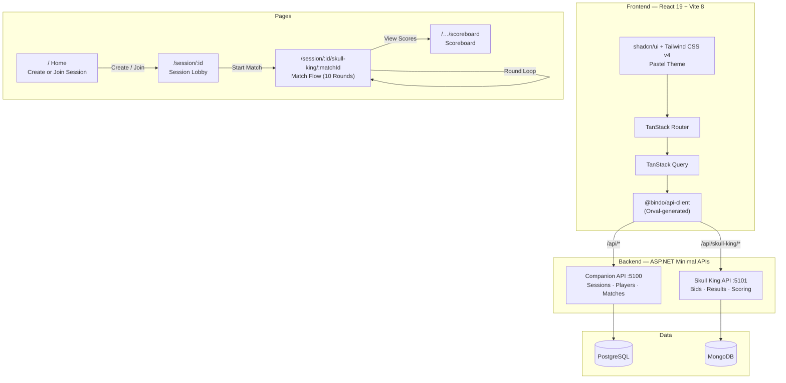

# Bindo Companion

Board game score tracker companion app -- currently supporting **Skull King**.


[](https://github.com/joaoc-dev/bindo-companion/actions/workflows/ci.yml)

## Architecture



## Built With

- React 19 + Vite 8 + TypeScript 5.9
- Tailwind CSS v4 + shadcn/ui (base-nova)
- TanStack Router + TanStack Query + TanStack Table
- react-hook-form + zod
- motion (framer-motion)
- .NET C# Minimal APIs (clean architecture, DDD, MediatR + CQRS)
- Orval for typed API client generation
- ESLint (Antfu config) + CSharpier
- Husky + lint-staged pre-commit hooks
- GitHub Actions CI (type-checking, linting, dependency checks)
- CodeRabbit AI code reviews
- Dependabot automated dependency updates

## Getting Started (Development)

```bash
aspire run
```

### PostgreSQL migrations (Companion API)

Start Aspire so the **postgres** container is running. The AppHost maps it to **localhost:5433** (user `postgres` / password `postgres`, database `companion`) so it does not fight with another PostgreSQL on **5432**. `Companion.Presentation` uses the same values in `appsettings.Development.json` for `dotnet ef`, which does not receive Aspire’s injected connection string.

The dashboard connection string is built from **current** parameters. PostgreSQL only applies `POSTGRES_PASSWORD` on **first** database init, so a **stale** named volume can keep an old superuser password while the UI still shows `Password=postgres` (**28P01**). Fix: `docker volume rm bindo-companion-postgres` once, then restart Aspire.

**Postgres shows Unhealthy but logs say “ready to accept connections”:** the icon reflects the **AppHost Npgsql health check** from your machine to the published port, not the container’s stdout. Some setups (notably **Rancher Desktop**) break that probe for session-scoped containers; this repo uses **`WithLifetime(ContainerLifetime.Persistent)`** on Postgres (see [Aspire issue #6818](https://github.com/dotnet/aspire/issues/6818)). If it stays unhealthy, try **Docker Desktop** or **Podman**, or confirm nothing else is listening on **5433** (`docker ps`). Clear AppHost user secrets if parameters were overridden: `dotnet user-secrets clear --project AppHost/AppHost.csproj`.

From the repository root:

```bash
dotnet ef database update --project apps/Server/Companion/Companion.Infrastructure/Companion.Infrastructure.csproj --startup-project apps/Server/Companion/Companion.Presentation/Companion.Presentation.csproj
```

## Notes

`apps/Client/Companion.WebApp/src/components/ui` is reserved for shadcn CLI output; ESLint ignores that folder so upstream styles stay unchanged.


## Adding new Companion PostgreSQL migrations

```bash
dotnet ef migrations add MigrationName --project apps/Server/Companion/Companion.Infrastructure/Companion.Infrastructure.csproj --startup-project apps/Server/Companion/Companion.Presentation/Companion.Presentation.csproj
```
